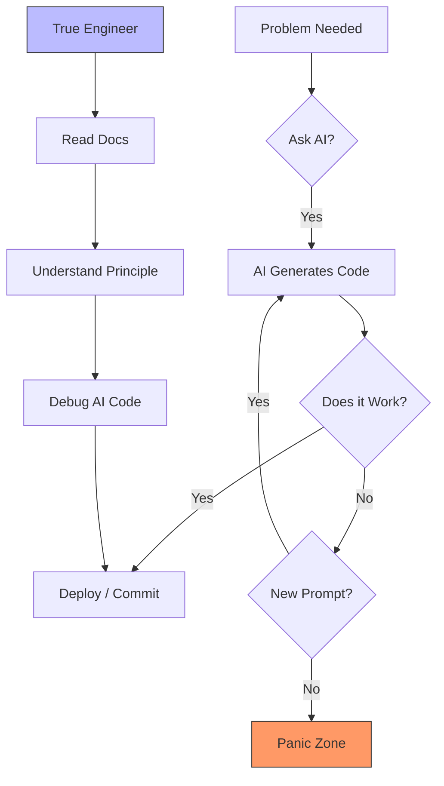
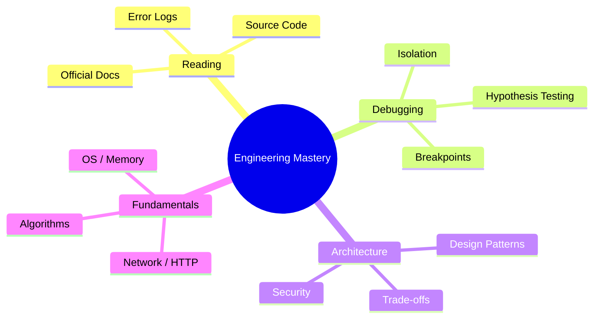

## はじめに：「動くけど、なぜ動くかわからない」という恐怖

「エラーが出たので、エラーメッセージをそのままChatGPTに投げました。修正案が出たのでコピペしました。また別のエラーが出ました……」

2026年の今、新人エンジニアからシニアの手前まで、多くの現場でこの「無限ループ」が見られます。
かつて Stack Overflow からコピペしていた時代は、まだマシでした。少なくとも、回答のスレッドには議論があり、バージョンの違いや「なぜそうするのか」というコンテキストが存在したからです。

しかし、今の私たちは「プロンプト」という魔法の呪文で、数秒で数百行のコードを手に入れます。
それは一見、生産性の革命に見えました。**「動かない」その瞬間までは。**

### 現場で起きている「ホラー」

*   **ケース1**: AIが書いた複雑なReactの `useEffect` が、特定の条件下でのみ無限ループを引き起こし、顧客のブラウザをクラッシュさせた。しかし、誰もそのフックの依存関係を理解していない。
*   **ケース2**: Pythonの非同期処理で、AIが提案した `asyncio.gather` の使い方が不適切で、高負荷時にメモリリークが発生。しかし、誰も `await` の裏側で何が起きているか知らない。
*   **ケース3**: セキュリティパッチを当てる際に、AIが提案した設定変更が、実は認証バイパスの脆弱性を含んでいた。しかし、誰もその設定値の意味をドキュメントで確認していなかった。

「AIが書いたコードの、どこがおかしいのかわからない」
「なぜこのライブラリが選ばれたのか説明できない」

この「ブラックボックス化した自分が書いた（はずの）コード」に対する恐怖。
これこそが、現代のエンジニアが抱える最大のストレス源です。本記事では、AI全盛の2026年にこそ求められる、**「あえて基礎に立ち返る（Back to Basics）」** という生存戦略について語ります。

## 2026年、エンジニアに求められる「5つの基礎力」

AIツールは進化しましたが、それは「ドライバー」を助けるためのものであり、あなたが「乗客」になっていいわけではありません。
むしろ、AIが高度なコードを書けば書くほど、それをレビューする人間には**より高度な基礎力**が求められるというパラドックスが起きています。

### 1. 「生成」よりも「読解」：レビュー力が最大の武器

これからのエンジニアの仕事は、**「Author（執筆者）」から「Editor（編集者）」へ** とシフトします。
AIは圧倒的な速度でドラフトを書けますが、その品質、セキュリティ、そして長期的な保守性を保証できるのは人間だけです。

「AIが出したコードを1行も読まずにCommitする」のは、編集者が原稿を読まずに出版するような自殺行為です。
**コードリーディングの速度と精度** こそが、現代の「強つよエンジニア」の条件です。

#### 具体例：AIがよくやる「微妙なバグ」を見抜く

例えば、AIに「リスト内の重複を削除して」と頼んだとします。

**AIのコード（一見動く）:**
```python
def remove_duplicates(items):
    result = []
    for item in items:
        if item not in result:
            result.append(item)
    return result
```

このコードは正しいですが、計算量は `O(N^2)` です。リストが数万件になると劇的に遅くなります。
基礎力のあるエンジニアなら、一目でこれを見抜き、「セット（集合）を使えば `O(N)` になる」と修正できます。

**修正後のコード:**
```python
def remove_duplicates(items):
    return list(set(items)) # 順序が不要な場合
```

このように、アルゴリズムとデータ構造の基礎知識（計算量オーダーの感覚）がないと、AIが提案する「動くけど遅いコード」をそのまま本番に投入してしまうことになります。

### 2. "RTFM" 2.0：一次情報への回帰

「このエラー、どう直せばいい？」とAIに聞く前に、**「公式ドキュメント（Manual）」** を読んでいますか？

AIは、Web上の膨大な情報の「平均値」を返します。つまり、古い情報や、ベストプラクティスではない情報も混ざっています。
特に進化の早いフロントエンド領域や、クラウドのSDKにおいて、AIが2年前の知識で自信満々に嘘をつく（Hallucination）ことは日常茶飯事です。

#### AI vs 公式ドキュメント

*   **AI**: 「この関数には `timeout` 引数があります（実はバージョン3系で削除された）」
*   **公式ドキュメント**: 「v4.0以降は `timeout` オプションは構成オブジェクトの中に移動しました。詳細はMigration Guideを参照してください」

**一次情報（Official Documentation）に当たる癖** をつけましょう。
「AIがこう言っているが、公式ドキュメントには非推奨と書いてある」
この気付きができるかどうかが、プロとアマチュアの分かれ目です。検索エンジンの使い方が下手なエンジニアは、AI時代には生き残れません。

### 3. デバッグの基礎：エラーメッセージを「読む」力

エラーログをそのままプロンプトに貼り付けるのを、一度やめてみてください。
そのエラーメッセージは、**開発者があなたのために残した手紙** です。

*   `NullReferenceException` / `AttributeError: 'NoneType' object has no attribute...`
    *   **思考停止**: 「AIに直させる」
    *   **エンジニア**: 「どの変数がNoneなのか？ なぜそこでNoneが入ったのか？ 上流のAPIレスポンスが変わったのか？」
*   `TimeoutError`
    *   **思考停止**: 「タイムアウト値を伸ばす（AIの提案）」
    *   **エンジニア**: 「DBのクエリがスロークエリになっているのではないか？ インデックスは効いているか？ ネットワーク経路の問題か？」

ブレークポイントを張り、変の中身を見て、スタックトレースを遡る。
この「泥臭いデバッグ作業」こそが、システムへの理解を深める最大のチャンスです。AIに答えを聞いて終わらせてしまうのは、**成長の機会をドブに捨てている** のと同じです。

### 4. 低レイヤーの理解：ブラックボックスを開ける

「なぜこのPythonコードは遅いのか？」
AIは「アルゴリズムを変えろ」と言うかもしれませんが、原因は「メモリ割り当てのオーバーヘッド」や「GIL（Global Interpreter Lock）」にあるかもしれません。

OS、ネットワーク（TCP/IP、DNS）、メモリ管理。
これらの「低レイヤー」の知識は、高レベルなAIコードが動かない時の「最後の砦」になります。

#### 具体例：データベースのコネクションプール

Webアプリが「たまに接続エラーになる」という問題。
AIは「再試行処理を入れましょう」と提案するかもしれません。しかし、根本原因が「TCPのTIME_WAIT状態のポートが枯渇している」ことだとしたら、再試行は事態を悪化させます。

「HTTPリクエストの裏側でTCPハンドシェイクが行われている」「コネクションプールがなぜ必要なのか」という仕組みを理解していれば、AIの対症療法的な提案に惑わされず、`sysctl` でカーネルパラメータを確認するなどの正しいアクションが取れます。

### 5. 「問い」を立てる力：プロンプトエンジニアリングの正体

良いプロンプトは、良いメンタルモデルから生まれます。
「なんか動かないから直して」というプロンプトからは、ゴミのような修正案しか出てきません。

「この非同期処理において、レースコンディションが発生している可能性がある。排他制御を追加したいが、パフォーマンスへの影響を最小限にするにはどうすべきか？ 言語はGoで、`sync.Mutex` とチャネルを使ったパターンの2つを比較して提示せよ」

このように、**問題の所在を特定し、制約条件を言語化できる** 能力。これこそが、真のプロンプトエンジニアリングです。
つまり、**「何がわからないか」がわかっている人** だけが、AIを使いこなせるのです。



## AIは「副操縦士」であり、「自動操縦」ではない

GitHub Copilotのアイコンを見てください。あれは「副操縦士（Co-pilot）」です。
操縦桿を握っているのは、いつだって**あなた（Pilot）** です。

飛行機が順調に飛んでいる時は、オートパイロットに任せてもいいでしょう。
しかし、乱気流に巻き込まれた時、計器が異常を示した時、**あなたはマニュアル操作で着陸させることができますか？**

「AIがないとコードが書けない」状態は、「オートパイロットがないと飛べないパイロット」と同じです。そんなパイロットの飛行機には、誰も乗りたくないでしょう。

## おわりに：「コピペ」から卒業し、真のエンジニアへ

AI時代の生存戦略はシンプルです。

1.  **Read Before Commit**: AIが書いたコードは、一行残らず理解してからコミットする。「理解できない行」はコミットしない。
2.  **Ask Why**: AIがバグを直してくれたら、「なぜそれで直ったのか？」を必ず自分に問う。ドキュメントで裏を取る。
3.  **Build from Scratch**: たまにはAIを切って、ゼロから何かを作ってみる。HTTPサーバーをソケット通信から書いてみる、パーサーを書いてみる。そういった「車輪の再発明」こそが、基礎力を養う最良のトレーニングです。

技術は変わります。言語も変わります。AIも進化します。
しかし、**「コンピュータはどう動いているのか？」** という物理的な真実と、それを解き明かそうとする知的好奇心は、いつの時代も色褪せることはありません。

さあ、今日は一度Copilotをオフにして、汚いスタックトレースと向き合ってみませんか？
そこにこそ、あなたが探している「真の実力」が埋まっているはずですから。
