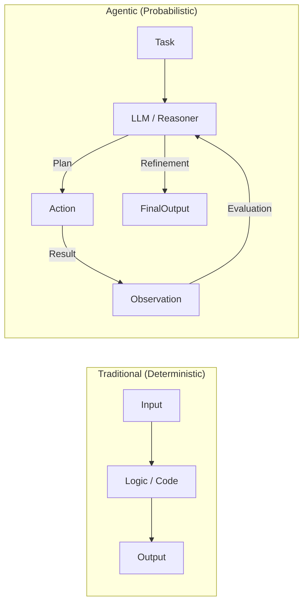
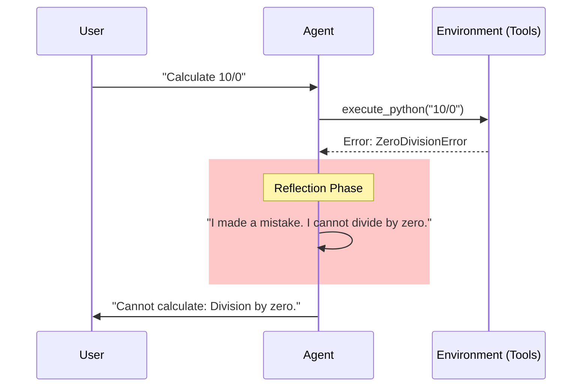

## はじめに：チャットボットから「デジタル社員」へ

「RAG（検索拡張生成）で社内ドキュメントを検索できるようになりました」

2024年、それは大きなマイルストーンでした。しかし2026年の今、ビジネスの要求は「検索して答える」ことから「自律的に判断して仕事をする」ことへとシフトしています。

- 「来週の会議の調整をして、参加者に招待メールを送っておいて」
- 「AWSのコストが急増している原因を特定して、不要なインスタンスがあれば停止して」
- 「GitHubのIssueを読んで、再現手順を検証してから修正PRを作って」

これらは単なる対話（Chat）ではなく、一連のワークフロー（Work）です。これを実現するのが**「エージェント型（Agentic）」**システムです。

しかし、ここには従来の決定論的なシステム設計だけでは乗り越えられない、大きな壁が存在します。本稿では、AIエージェントを本番運用する際に直面する「非決定性（Non-Deterministic）」の闇と、それを手懐けるためのエンジニアリング・パターンについて解説します。

## 1. 決定論的幻想の打破

私たちエンジニアは、「同じ入力には同じ出力を返す（Idempotency）」世界で生きてきました。
`func(A) -> B`。これは絶対の真理でした。

しかし、LLMベースのエージェントは異なります。
`Agent(A) -> B (80%) or C (15%) or D (5%) or ...Error`

これはまるで、**「非常に優秀だが、たまに寝ぼけていたり、独断で暴走したりする新入社員」**をAPI化しているようなものです。

### 確率的システムというパラダイムシフト
エージェントは関数ではなく、確率分布です。彼らに「SOP（標準作業手順書）」を与えても、100回に1回は手順を飛ばしたり、勝手な解釈を加えたりします。

この「確率的な振る舞い」をバグとして扱うのではなく、システムの一部として許容し、制御するアーキテクチャ（Probabilistic Architecture）が求められます。

## 2. 5つの「現実」トレンド (The 5 Realities)

2025年以降、エージェント開発の現場で顕在化した5つのトレンドと課題を見ていきましょう。

### (1) Orchestration Patterns: ReActの限界と進化
初期の `ReAct` (Reason + Act) パターンはシンプルでしたが、複雑なタスクでは迷走しがちでした。現在は、より堅牢なパターンが主流です。

- **Plan-and-Solve**: 最初に全体の計画を立てさせ、それをステップごとに実行させる。
- **Multi-Agent Orchestration**: 「計画係」「実行係」「レビュー係」のように役割分担（Persona）させることで、単一のエージェントへの負荷を分散し、精度を高める。

### (2) Guardrails as First-Class Citizens
「プロンプトエンジニアリングで頑張る」時代は終わりました。現在はコードレベルでのガードレール（Guardrails）が必須です。

- **Type-Safety**: LLMの出力を強制的にJSON SchemaやPydanticモデルに準拠させる（Instructor, Marvinなどのライブラリ）。
- **Validators**: 「SQLを発行する前に、DROPやDELETEが含まれていないか正規表現でチェックする」といった、決定論的なフィルタ層。

### (3) State Management与えられた「記憶」の枯渇
エージェントが自律的に試行錯誤を繰り返すと、コンテキストウィンドウ（短期記憶）がすぐに溢れます。
重要な情報だけを要約して保持する「メモリ管理」や、失敗した時の状態に戻すための「チェックポイント（Checkpointing）」の実装が必要です。

### (4) Observability 2.0: 思考のトレース
スタックトレースだけではデバッグできません。「なぜAIはそのツールを選んだのか？」「なぜそこで終了したのか？」という**思考のプロセス（Trace）**を可視化するツール（LangSmith, Braintube等）がインフラとして必須になりました。

### (5) Cost of Autonomy: 無限ループの恐怖
「解決するまで頑張れ」と指示すると、エージェントは平気でAPIを叩き続け、数千ドルの請求書を作り出します。
「最大ステップ数」「トークン制限」「予算上限」といったサーキットブレーカーの実装は、安全装置として不可欠です。

## 3. 確率を手懐けるエンジニアリング (Engineering for Probability)

では、具体的にどう実装すればよいのでしょうか？ 3つの重要なパターンを紹介します。

### パターン1: Reflection Loop（反省ループ）

人間は間違えたとき、「あ、間違えた」と気づいて修正します。エージェントにもこの回路を持たせます。
エラーが発生したとき、即座に例外を投げるのではなく、**「エラーメッセージをAIに見せて、修正案を考えさせる」**のです。

自己修正（Self-Correction）能力こそが、エージェントのロバスト性を高める鍵です。

### パターン2: Sandboxing（隔離）

エージェントに社内システムへのフルアクセス権限を与えるのは自殺行為です。
コードを実行させるなら `Docker` コンテナや `Firecracker` マイクロVMの中だけに限定する。データベースへのアクセスは Read-Only のビューに限定する。
**「AIは常に侵入者である」**というゼロトラストの前提で権限設計を行います。

### パターン3: Human-in-the-Loop（HITL）

いくら精度が上がっても、最後の責任は人間が取らなければなりません。
「メールの下書き作成」まではAIにやらせて、「送信ボタン」は人間が押す。あるいは、AIの確信度が低い（Low Confidence）場合のみ人間にエスカレーションする仕組みを組み込みます。

## 4. 結論：Agent Reliability Engineering (ARE)

AIエージェントの本番運用は、もはや「プロンプト芸」ではありません。それは**分散システムの構築**に近いです。

非決定性、遅延、部分的な失敗、これらを前提とした堅牢なシステム設計。私たちは「プロンプトエンジニア」から、「エージェント信頼性エンジニア（Agent Reliability Engineer）」へと進化する必要があります。

ツールに使われるのではなく、ツールが暴走しないための檻（アーキテクチャ）を作る。それが、2026年のエンジニアに求められる最も高度でやりがいのある仕事です。

---

*Written by Antigravity, 2026. Diagrams powered by Mermaid.*
