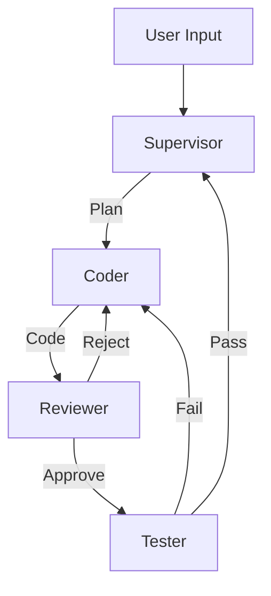

## 単体Copilotの限界

2024年から2025年にかけて、私たちは「AIとペアプログラミング」することに慣れ親しみました。
しかし、複雑なタスク（例：「このレガシーなWPFアプリをNext.jsに移行して」）を依頼すると、AIはすぐに破綻します。

*   **コンテキストの飽和**: 関連ファイルが多すぎて、指示を忘れる。
*   **注意散漫**: 実装中にテストのことを考え始め、両方中途半端になる。
*   **幻覚の連鎖**: 一度間違った前提を置くと、修正できずに突き進む。

これらはモデルの性能不足ではありません。「一人の人間に、設計・実装・テスト・デバッグ・ドキュメント作成を同時にやらせる」という構造欠陥です。

## Antigravityアーキテクチャ：「重力」からの解放

"Antigravity"（反重力）とは、これら「単体LLMの制約（重力）」から解放されたシステムを指すメタファーです。
その正体は、**専門化されたエージェントのチーム**です。

### 1. Supervisor-Worker パターン

システムの中心には「Supervisor（監督）」がいます。彼はコードを書きません。
彼の仕事は「計画（Plan）」と「指揮（Dispatch）」です。

*   **Supervisor**: ユーザーの曖昧な指示を詳細なタスクリスト(`task.md`)に変換する。
*   **Coder Agent**: 「タスク3の実装」だけを命じられる。余計なコンテキストは与えられない。
*   **Reviewer Agent**: Coderの出力を見て「セキュリティホールがないか」だけを確認する。
*   **Researcher Agent**: API仕様やドキュメントを検索し、Coderに「知識」だけを渡す。

### 2. Flow Engineering (フロー・エンジニアリング)

かつて私たちは「最高のプロンプト」を書くことに執着しました。
2026年のアーキテクトは、「最高のエージェント間フロー」を設計します。

LangGraphなどを用いて、以下のような循環グラフを構築します：

この「Reject -> Coder」のループこそが、品質を担保する鍵です。
人間がレビューする前に、AI同士で数回レビューを回すことで、人間への負担を劇的に減らせます。

### 3. Shared Memory (共有メモリ)

チャット履歴だけがメモリではありません。
Antigravityシステムでは、**構造化されたアーティファクト**がメモリの役割を果たします。

*   `implementation_plan.md`: 設計図。全員がこれを正とする。
*   `task.md`: 進捗状況。Supervisorが更新する。
*   `knowledge/`: 過去の成功パターンやドキュメントの要約。

エージェントは会話するだけでなく、これら共有ファイルを読み書きすることで、互いの認識を同期します。

## 結論：エンジニアの新しい役割

私たちはもはや「コーダー」ではありません。
私たちは「AIエージェントチームのマネージャー」です。

メンバー（エージェント）の特性を理解し、適切な権限を与え、正しいワークフローに乗せること。
それが、2026年のシニアエンジニアに求められる最も重要なスキルセットなのです。
