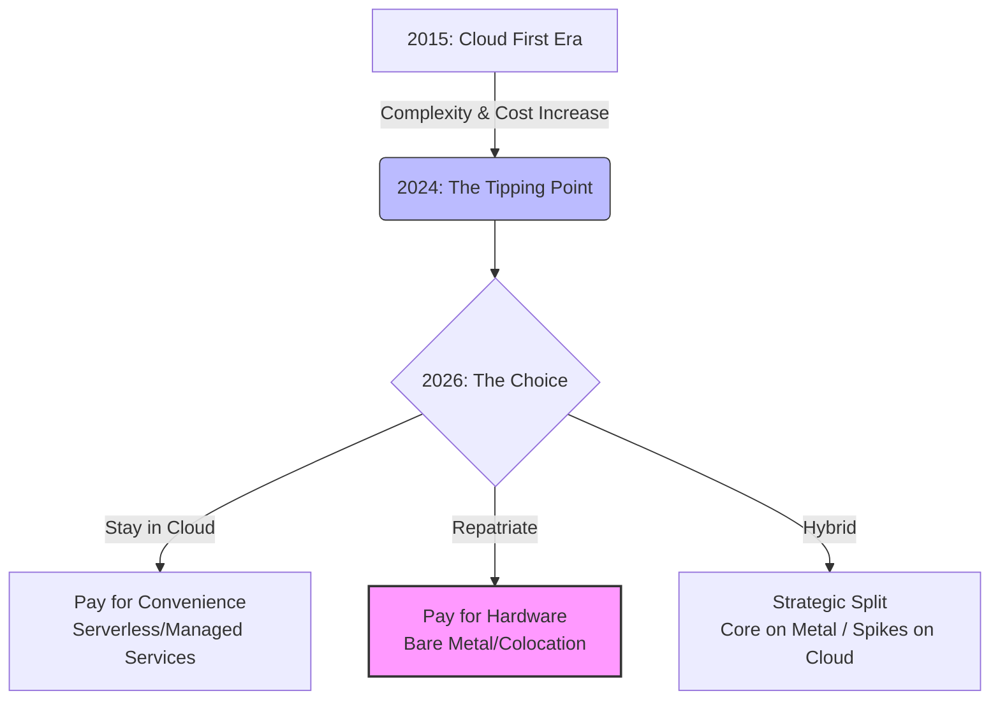
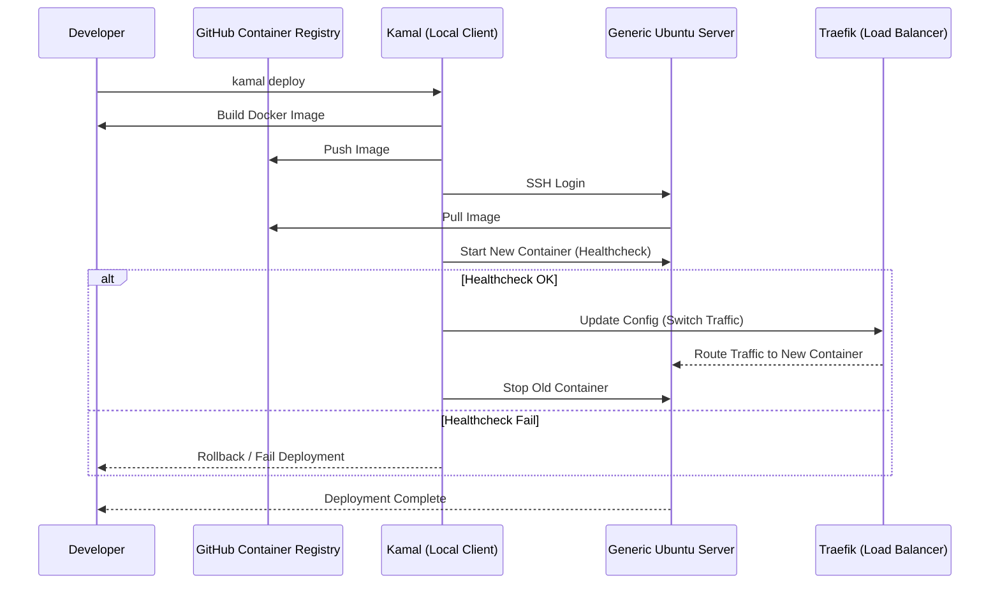

## はじめに：なぜ私たちは「毎月の請求書」に怯えるようになったのか

「cronジョブを1つ定期実行したいだけなのに、なぜIAMロールの設定と、VPCエンドポイントの作成と、CloudWatchのロググループ設定、そしてEventBridgeのルール定義が必要なんだ？」

2026年の今、多くのエンジニアがこの「違和感」を抱えています。
かつて、VPS（Virtual Private Server）を借りて `apt-get install` し、`crontab -e` を叩いていた時代は、確かにスケーラビリティに欠けていました。しかし、そこには圧倒的な「シンプルさ」がありました。

それがいつしか、「Cloud First」の名の下に、あらゆる構成がマイクロサービス化され、サーバーレス化されました。
「サーバー管理は差別化につながらない労働（Undifferentiated Heavy Lifting）である」というAWSのマーケティングメッセージは、確かに一理ありました。しかし、私たちはその言葉を信じすぎてしまったのかもしれません。

結果、私たちを待っていたのは、複雑怪奇なアーキテクチャ図と、**「便利さ」という名目で請求される高額なクラウド利用料**でした。

*   **NAT Gateway**: データを外に出すだけで発生する謎の課金。
*   **Provisioned IOPS**: 本番DBのパフォーマンスを維持するためだけに払う「場所代」。
*   **Egress Fees**: クラウドからデータを取り出す際に発生する「出国税」。

本記事では、AWSやGCPを否定するわけではありません。彼らは依然として、世界最強のツールキットです。
しかし、振り切れすぎた振り子を「適正な位置」に戻すための議論——**Cloud Repatriation（クラウドからの回帰）**について、2026年の視点から、感情論ではなく「技術とコストの合理的判断」として深掘りします。

## 「持たざる者」から「持つ者」へ：2026年のインフラ回帰トレンド

この潮流は、単なる懐古主義ではありません。明確な経済的勝算に基づいた戦略的撤退です。

### 1. 「Cloud Exit」の成功事例と数字：37signalsとAhrefs

この流れを決定づけたのは、やはり **37signals（Basecamp/HEY）** の事例でしょう。
彼らはクラウドから完全に撤退し、自社ハードウェア（オンプレミス/コロケーション）へ移行することで、**5年間で約1,000万ドル（約15億円）のコスト削減**を見込んでいます。

彼らが公開したデータは衝撃的でした。
「AWSの請求書には、私たちのビジネスの成長とは無関係な項目が多すぎる」
彼らは、S3に保存していたペタバイト級のデータを、自前のDell製サーバーとPure Storageに移行しました。結果、ストレージコストは劇的に下がりました。

また、SEOツールの雄である **Ahrefs** も、カタログスペックだけで言えば数十億円規模になるAWSコストを、約60人のハードウェアチームと自前のデータセンターで運用することで回避しています。彼らの試算によれば、「もしAWSを使っていたら、現在のサービス価格では大赤字だった」と言います。

計算式は極めて単純です。

**クラウドのコスト > (ハードウェア費用 + データセンター費用 + 運用エンジニアの給与)**

この不等式が成り立った瞬間、クラウドに留まる経済的合理性は消失します。
特に、以下の特徴を持つワークロードは、クラウドに置くことで「罰金」を払っているような状態になりがちです。

*   **常時稼働している（24/365）**: オートスケーリングの恩恵を受けにくい。
*   **帯域幅を大量に消費する**: Egress Fee（データ転送料）が利益を圧迫する。
*   **メモリを大量に消費する**: クラウドのメモリ単価は、物理メモリの市場価格に比べて非常に高い。

### 2. ハードウェアのコモディティ化と「爆速ベアメタル」

2026年の現在、ハードウェアの性能向上は目を見張るものがあります。ここでのキーワードは「コモディティ化」です。

かつて「スーパーコンピュータ」と呼ばれていたようなスペックが、今では月額数万円のベアメタルサーバーで手に入ります。
例えば、AMD EPYC（Genoa/Turin世代）を搭載したサーバーを見てみましょう。

*   **CPU**: 128コア / 256スレッド
*   **Memory**: 1TB DDR5
*   **Storage**: 30TB NVMe Gen5 (RAID 10)

これをAWSの `r7i.metal` クラスで調達しようとすれば、オンデマンド料金で月額数百万円は下りません。しかし、HetznerやOVH、あるいは国内のベアメタルクラウド事業者であれば、その数分の一の価格で利用可能です。

特に **NVMe SSD** の進化は、データベースの設計思想を変えました。
クラウド（EBS）では、IOPSを確保するために高額な `io2` プロビジョンドIOPSボリュームを契約する必要がありました。しかし、物理サーバーに直接刺さったNVMeは、ネットワーク越しではないため、レイテンシもスループットも桁違いです。

「DBのシャーディングが必要？ いや、まずは1台の最強サーバーに入れてみよう」
これが2026年のリアルな会話です。**「富豪的垂直スケーリング」** ——つまり、複雑な分散システムを組むよりも、強靭な1台のサーバーでシンプルにさばく方が、実は可用性リスクを含めてもトータルコストが安いという原点回帰が起きています。

### 3. "Bring Your Own PaaS" の台頭 (Kamal, Coolify)

「ハードウェアが安いのはわかった。でも、HerokuやVercelのような『git pushでデプロイ』体験は捨てられない。いちいちSSHして `git pull` して `systemctl restart` なんて地獄だ」

その通りです。Developer Experience (DX) を犠牲にしたコスト削減は、組織のベロシティを殺します。
だからこそ、2025年から2026年にかけて爆発的に普及したのが、**"Bring Your Own PaaS" (BYO-PaaS)** ツールです。

代表格は、37signalsが開発した [**Kamal**](https://kamal-deploy.org/) （旧Mrsk）と、セルフホストPaaSの [**Coolify**](https://coolify.io/) です。

これらは、**「自分の持っているベアメタルサーバー（素のUbuntu等）を、自分専用のPaaSにする」** ためのツールです。
Kubernetesのような重厚なコントロールプレーン（etcdの管理やネットワークプラグインの選定）を必要としません。必要なのは、Dockerだけです。

#### Kamal のデプロイフロー

Kamalは非常にシンプルです。ローカルマシンからコマンド一発で、世界中のサーバーにコンテナをデプロイします。

このフローの美しさは、「サーバー側に特別なエージェントが不要」という点です。SSHさえ繋がれば、物理サーバーだろうが、格安VPSだろうが、ラズパイだろうが、すべてがあなたの「クラスター」になります。
Traefikが自動的にリバースプロキシとして機能し、ゼロダウンタイムデプロイメント（Blue-Greenに近い挙動）を実現してくれます。

これにより、「運用の手軽さ（PaaS体験）」と「ハードウェアの安さ（ベアメタル）」のいいとこ取りが可能になったのです。

## 「銀の弾丸」ではない：オンプレミス回帰の落とし穴

ここまで「脱クラウド」の夢を語ってきましたが、現実的なリスクについても語らねばなりません。
安易な動機でオンプレミスに戻ると、地獄を見ます。そこには明確なリスクと、**「隠れたコスト」** が存在します。

### Operational Debt（運用という負債）

クラウドにお金を払うということは、**「運用リスクをAmazonやGoogleに転嫁している」** ということです。
RDSを使わずに自前でPostgreSQLを運用する場合を想像してください。

*   **バックアップ**: 正しく取得できていますか？ リストア訓練はしましたか？
*   **HA（高可用性）**: プライマリが死んだとき、自動でスタンバイに切り替わりますか？ Patroniの設定は完璧ですか？
*   **セキュリティパッチ**: OSの脆弱性が発表された夜、誰がアップデート作業をしますか？
*   **ハードウェア故障**: ディスクが壊れたとき、データセンターに行って交換する手配（またはリモートハンドサービスの依頼）フローは確立されていますか？

「AWSの請求書」が月額50万円減っても、その対応のために年収1000万円のエンジニアの時間の半分が奪われるなら、会社としては損をしています。
ビジネスのフェーズ（特にPMF前）においては、高いクラウド料金は「時間の購入」として、正当な投資です。脱クラウドは、**「時間が余り始め、コストが重荷になり始めた成長期・成熟期」** に検討すべき戦略です。

### ネットワークの「単一障害点」

クラウドの隠れたメリットは、ネットワークの堅牢性です。
自前でラックを借りる場合、そのデータセンターのネットワークスイッチが死んだら？ 上流回線でDDoS攻撃を受けたら？
AWS Shieldのような自動防御システムを、自前で構築するのは容易ではありません。Cloudflareなどを前段に置くことで緩和は可能ですが、ネットワーク設計の難易度は格段に上がります。

## 賢い折衷案：2026年流「ハイブリッド」戦略

では、どうすればいいのか？
0か100か（フルクラウドかフルオンプレか）ではありません。2026年の賢いエンジニアは、**「ハイブリッド」** を選びます。それも、VPCと専用線を繋ぐような大掛かりなものではなく、もっと緩やかな連携です。

### パターンA: "The Mullet Architecture" (Business in the front, Party in the back)

*   **Front (Business)**: WebサイトやAPIの入り口は、Cloudflare WorkersやVercel Edgeなどのエッジコンピューティング、または小規模なAWS App Runnerを利用。DDoS対策とグローバル配信を任せる。
*   **Back (Party)**: 重たい処理、バッチジョブ、巨大なデータベースは、裏側のベアメタルサーバー（Hetzner/OVH/さくらインターネット）で回す。

### パターンB: "Storage Offloading"

*   **App & DB**: コンピュートリソースはベアメタルで安く済ませる。
*   **Object Storage**: 信頼性が生命線であり、自前運用の難易度が高いオブジェクトストレージ（画像やバックアップ）だけは、S3（またはCloudflare R2）を使う。

特にR2のような「Egress Fee無料」のストレージサービスは、脱クラウド戦略の強力な味方です。

## おわりに：「インフラ主権」を取り戻せ

昨今の「脱クラウド」トレンドの本質は、コスト削減だけではありません。
それは、**「自分たちが使っている技術スタックの主導権を、自分たちの手に取り戻す」** という宣言でもあります。

ベンダーロックインによる値上げに怯えるのではなく、自分たちのサービスに最適なインフラを、自分たちで選び、構築し、運用する。
そのための選択肢として、クラウドもオンプレミスも、対等なテーブルに乗せる。

「クラウドを使うな」と言っているわけではありません。「思考停止でクラウドを使うな」と言いたいのです。

もしあなたが、「インフラはクラウドにあるのが当たり前」と思って育ってきたなら、一度、月額数千円の専用サーバーを借りて、そこに自分の手でWebサーバーを立ち上げ、Kamalでアプリをデプロイしてみてください。
黒い画面の向こう側に、ブラックボックスのない、シンプルで力強い「コンピューティングの手触り」があるはずです。

振り子は戻りました。しかし、以前と同じ場所に戻ったわけではありません。
コンテナとPaaSツールという武器を手に入れた私たちは、より賢く、より自由に、インフラを選べる時代に生きています。

さあ、あなたは2026年のインフラをどう設計しますか？
