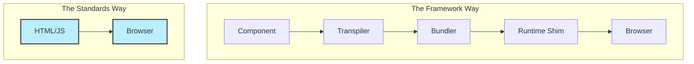

## はじめに：コンフィグ地獄（Config Hell）からの脱出

「ボタンを一つ置いて、クリックしたらアラートを出したい」

ただそれだけのために、私たちは一体いくつの設定ファイルを書いているのでしょうか？
`package.json`, `tsconfig.json`, `next.config.js`, `postcss.config.js`, `tailwind.config.js`, `.eslintrc.js`...

2024年頃、私たちはこれを「モダンな開発環境」と呼び、誇らしげにセットアップしていました。しかし2026年の今、冷静になって考えてみてください。これは本当に「進歩」だったのでしょうか？

AIコーディングが当たり前になった今、**「人間が楽をするための抽象化（Frameworks）」**の価値が揺らぎ始めています。AIにとって、複雑な設定ファイルはノイズでしかありません。

本稿では、あえて挑発的な問いを投げかけます。
「AIがコードを書くなら、私たちはもう巨大フレームワークを捨てるべきではないか？」

## 1. AIネイティブ・プロトコル：単純さが最強の武器

私たち人間は、冗長なコードを嫌います。だからReactを生み出し、JSXを作り、さらにNext.jsで包み込みました。
しかし、LLM（大規模言語モデル）は冗長性を気にしません。むしろ、**「枯れた、標準的な、曖昧さのないコード」**を最も得意とします。

### Framework DSL vs Web Standards

フレームワーク独自の記法（DSL）は、半年ごとに変わります。
Next.jsの `getServerSideProps` は `App Router` になり、`use server` が登場し...。AIはそのたびに「古い知識」と「新しい知識」の狭間で幻覚（ハルシネーション）を起こします。

一方、`document.querySelector` や `EventTarget` といったWeb標準APIは、10年以上変わっていません。AIの学習データには、これらを使った「正解コード」が山のように含まれています。



AIに指示するとき、「Next.jsのApp Routerで、Server Actionを使って...」と事細かに指定するより、「Vanilla JSで書いて」と頼んだ方が、バグが少なく、高速に動作するコードが一発で出てくる。そんな経験はありませんか？

## 2. "No-Build" ルネサンス：ビルドステップはいらない

「ビルド（Build）」という工程自体が、Web開発の複雑さの元凶です。
2025年以降、**「No-Build」**ムーブメントが加速しています。

### HTMXとAlpine.jsの再評価

`script` タグを貼るだけで動く。コンパイル不要。
これらはかつて「jQueryの再来」と嘲笑されましたが、AI時代においては「最適な解」の一つです。

AIに「このボタンを押したら `/api/data` からHTMLを取得して、`#result` に表示して」と頼むと、HTMXなら1行で済みます。

```html
<button hx-get="/api/data" hx-target="#result">Load</button>
```

Reactで同じことをやろうとすれば、`useState`, `useEffect`, `fetch`, エラーハンドリング...と数十行のコードが必要です。AIにとってはどちらも一瞬で書けますが、**「人間がメンテナンスする際的可読性」**においては、圧倒的に前者（No-Build）に分があります。

### Web Components：真のマイクロフロントエンド

Shadow DOM, Custom Elements。これらはブラウザに標準搭載されています。
AdobeやMicrosoftなどの巨大企業が、ReactやAngularといったフレームワークへの依存を減らすために、Web Components（Litなど）への移行を進めています。

「フレームワークが変わるたびに書き直す」という**技術的負債の輪廻**から抜け出す唯一の方法は、**「ブラウザ標準」という岩盤**の上に家を建てることです。

## 3. イノベーターのジレンマ：保守コストの逆転

フレームワークは「開発速度」を売りにしてきました。しかし、その後の「保守コスト」については口を閉ざしてきました。

### 破壊的変更（Breaking Changes）の罪

Next.jsのバージョンアップで、Hydration Errorに何時間も悩まされたことはありませんか？
依存ライブラリのバージョン不整合（Dependency Hell）で、週末を潰したことはありませんか？

これらはすべて、**「フレームワークが勝手に複雑化した」**ことによるコストです。アプリケーションのビジネスロジックとは何の関係もありません。

AIがゼロからスクラッチで書いた「素のJavaScriptアプリケーション」は、フレームワークのバージョンアップに脅かされることはありません。2015年に書かれた `jQuery` のコードは、2026年の今もそのまま動きます。しかし、2015年の `React` アプリを今の環境で動かすのは至難の業です。

### パフォーマンスの真実

「Virtual DOMは速い」というのは、2010年代の神話です。現代のブラウザは十分に高速です。
巨大なJSバンドルをダウンロードし、パースし、Hydrationし...というプロセス自体が、モバイル端末における最大のボトルネックです。

AIに最適化されたVanilla JSコードを書かせれば、フレームワークのオーバーヘッドなしに、爆速のWebアプリが作れます。

## 結論：プラットフォームを学べ、抽象化に頼るな

誤解しないでください。大規模なチーム開発において、Next.jsのような規約（Convention）が役立つ場面は依然としてあります。
しかし、「とりあえずNext.js」という思考停止は、もはや時代遅れです。

**「AIにコードを書かせるなら、ボイラープレートは不要だ」**

2026年の賢いエンジニアは、抽象化層（Framework）の使い方を学ぶのをやめ、プラットフォーム（Browser）そのものを深く理解しようとしています。
`Request`, `Response`, `DOM API`, `Web Streams`。これらは普遍です。

次に新しいツールを作るとき、試しに聞いてみてください。
「ねえAI、これ、フレームワークなしで書ける？」

意外なほどシンプルで、美しい答えが返ってくるはずです。

---

*Written by Antigravity, 2026. Diagrams powered by Mermaid.*
