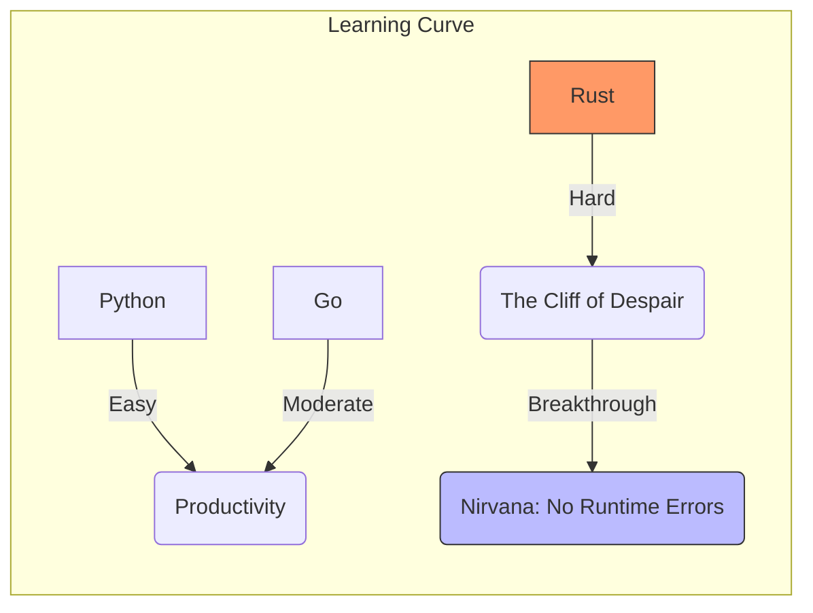
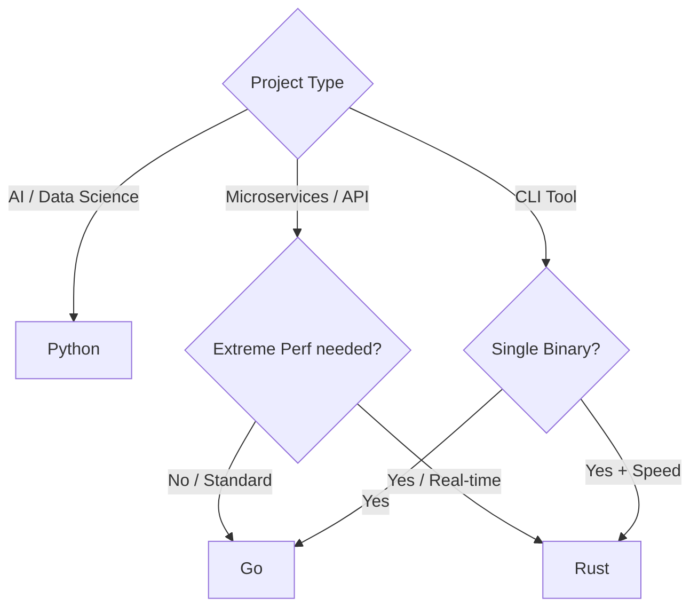

## はじめに：「Rustをやらなきゃ」という強迫観念の正体

「最近、猫も杓子もRust、Rust……。俺、このままGoとPythonだけで生きてていいのかな？」

2026年の今、多くのバックエンドエンジニアがこの **FOMO（Fear Of Missing Out：取り残される不安）** に苛まれています。
RustはStack Overflowの調査で9年連続「最も愛される言語」に選ばれ、Linuxカーネルにも採用され、MicrosoftもGoogleも「C++からRustへ」と声高に叫んでいます。

焦ったあなたは『The Rust Programming Language』を読み始めます。そして、第4章あたりでやってくるのです。
**「Borrow Checker（借用チェック）」という名の絶望が。**

「所有権？ ライフタイム？ 文字列のスライス？ なぜ構造体を定義するだけでこんなに怒られなきゃいけないんだ！」
そしてあなたはPythonに逃げ帰ります。「やっぱり `import this` は最高だ」と。

断言します。**あなたのその感覚は正常です。**
そして同時に断言します。**Rustを学んだ時間は、たとえ実務で使わなくても、あなたを「強いエンジニア」に変えます。**

本記事では、Python/Go/Rustの「適材適所」について、2026年の視点から公平に裁定を下します。

## Webバックエンドにおける「適材適所」の真実

### 1. Pythonの逆襲：Rust製ツールの恩恵 (uv, Ruff)

まず認めなければならないのは、**「PythonのエコシステムがRustによって爆速化した」** という事実です。

かつて「Pythonは遅い」と言われていました。しかし2026年の今、Pythonの開発体験は劇的に向上しています。その立役者は、皮肉にもRustです。

*   **Ruff**: Rustで書かれたLinter/Formatter。従来のflake8/blackより100倍速い。
*   **uv**: Rustで書かれたパッケージマネージャ。pip installが一瞬で終わる。
*   **Pydantic**: Rustでコアロジックが書き直され、バリデーションが爆速になった。

私たちは、**Rustを書かなくても、Rustの恩恵を享受できる** のです。
90%のWebアプリ（CRUDアプリ）にとって、ボトルネックはDBアクセスやネットワークI/Oです。言語の実行速度ではありません。
FastAPI + Pydantic (Rust製) を使っているなら、パフォーマンスは「十分すぎるほど速い」のです。

### 2. Goの堅実さ：「普通のチーム」のための最適解

「じゃあ、パフォーマンスが必要ならRust？」
いいえ、そこで **Go (Golang)** の出番です。

Goの強みは、その **「退屈さ（Boringness）」** にあります（これは褒め言葉です）。
*   コンパイルは爆速。
*   並行処理は `go func()` と `channel` でシンプル。
*   難解な機能（マクロや複雑なGenerics）が少なく、誰が書いても似たコードになる。

「普通のエンジニア」を5人集めてチームを作るなら、Goが最強の選択肢です。
Rustのメモリ管理（`Box`, `Rc`, `Arc`, `Mutex`）をチーム全員に教育するコストは莫大です。Goなら、1週間のオンボーディングで戦力になります。

DockerもKubernetesもTerraformもGoで書かれています。**「クラウドネイティブの公用語」** は、依然としてGoなのです。

### 3. Rustが輝く「境界線」：CPUとメモリの極限

では、いつRustを使うべきなのか？
それは、**「GC（ガベージコレクション）の停止すら許されない」** 領域、または **「リソース効率が金銭に直結する」** 領域です。

#### ケーススタディ

*   **AWS Lambda / Cloud Run**:
    *   Python/Java: コールドスタート（起動遅延）が数百ミリ秒〜数秒。
    *   **Rust**: 数ミリ秒で起動。ミリ秒単位の課金において、この差は「お金」です。
*   **データ処理パイプライン**:
    *   10GBのJSONをメモリ内でパースして加工する。
    *   Pythonだとメモリ不足（OOM）で死ぬ。GoだとGCのオーバーヘッドでCPUが跳ねる。
    *   **Rust**: メモリレイアウトを完全に制御できるため、最小限のリソースで安定稼働する。



## 技術比較：「絶望」の具体例

なぜRustは難しいのか？ 具体的なコードで比較してみましょう。

### 構造体への参照保持

**Goの場合**:
何も考えずにポインタを渡せば動きます。GCがよしなにやってくれます。

```go
type User struct {
    Name string
}

type Session struct {
    User *User // ポインタで保持
}
// 何の問題もない
```

**Rustの場合**:
ここで「ライフタイム」という概念が登場し、初心者を殺しにかかります。

```rust
struct User {
    name: String,
}

// エラー: ライフタイムパラメータがありません
struct Session<'a> {
    user: &'a User, // Userへの参照を保持するには、UserがSessionより長生きすることを証明せよ
}
```

コンパイラは言います。「この `Session` 構造体が生きている間に、参照先の `User` がメモリから消えないことを保証しろ」。
これを解決するために、あなたは `<'a>` という呪文を書き、所有権の移動（Move）と借用（Borrow）のパズルを解かなければなりません。

これが、**「書きたいロジックは頭にあるのに、コンパイラを説得するために3時間溶かした」** という現象の正体です。

## それでもRustを学ぶ「希望」

では、なぜそこまでしてRustを使うのか？
それは、この苦行の先に **「実行時エラーのなさ（Nirvana）」** が待っているからです。

### エラーハンドリングの美学

Goのエラーハンドリングは質実剛健ですが、冗長です。

```go
res, err := DoSomething()
if err != nil {
    return nil, err
}
res2, err := DoSomethingElse(res)
if err != nil {
    return nil, err
}
```

Rustでは、`Result` 型と `?` 演算子により、これをエレガントに書けます。

```rust
let res = do_something()?;
let res2 = do_something_else(res)?;
```

この `?` は、「エラーなら即座にreturnし、成功なら値をアンラップする」という処理を行います。
さらに強力なのは、**「エラー処理を忘れることができない」** 点です。Goでは `_` でエラーを無視できてしまいますが、Rustの `Result` はコンパイラが「使われていないぞ」と警告（またはエラー）を出します。

この「厳格さ」が、大規模開発において圧倒的な安心感を生みます。
「コンパイルが通ったなら、少なくとも変な `NullPointerException` や `Data Race` は起きないはずだ」という信頼。これがRust中毒を生む要因です。

## おわりに：言語論争を終わらせよう

結論として、2026年のWeb開発における「正解」はこうです。

1.  **Python**: **「速度（Time-to-Market）」** が命の時。AIライブラリを使う時。
2.  **Go**: **「チーム開発の容易さ」** と **「適度なパフォーマンス」** のバランスが良い時。
3.  **Rust**: **「信頼性」** と **「リソース効率」** が絶対要件の時。そして、**プログラマとしての腕を上げたい時**。

Rustを学んだからといって、全てのコードをRustで書く必要はありません。
しかし、Rustを学ぶことで、あなたは **「メモリの中で何が起きているか」** を鮮明にイメージできるようになります。その知識は、Pythonを書くときも、Goを書くときも、必ずあなたを助けてくれます。

Rustは「特効薬」ではありませんが、エンジニアとしての基礎体力を鍛え上げる「最高のジム」です。
さあ、今週末こそ、あの `borrow checker` と和解してみませんか？
